# Red Stealer Lab on CyberDefender

---
**Category:** Threat Intel  
**Tactics:** Execution, Persistence, Privilege Escalation, Defense Evasion, Discovery, Collection, Impact  
**Tools:** Whois, VirusTotal, MalwareBazaar, ThreatFox, ANY.RUN  

---
## **Investigation Approach:**
1. **Understanding the Scenario:** First, I reviewed the scenario to determine key areas to focus on during the investigation. Also the questions for more in depth knowledge of what is going on.
2. **VirusTotal Analysis:** Using the provided hash, I conducted a full analysis on VirusTotal, absorbing all the relevant details, from VirusTotal
3. **Additional Intelligence Gathering:** I leveraged other tools such as Whois, MalwareBazaar, ThreatFox, and ANY.RUN to gather supplementary threat intelligence.

> **Note:** While I previously used VirusTotal mainly for quick malware checks, this exercise deepened my understanding of its full investigative capabilities.

--- 
### **Q1. Categorizing malware enables a quicker and easier understanding of its distinct behaviors and attack vectors. What is the category of the identified malware?**

**Answer:** Trojan

 [view on VirusTotal](https://www.virustotal.com/gui/file/248fcc901aff4e4b4c48c91e4d78a939bf681c9a1bc24addc3551b32768f907b)

 A Trojan is a type of malware that disguises itself as a legitimate program to infect a system, steal data, install additional malware, or disrupt operations.  

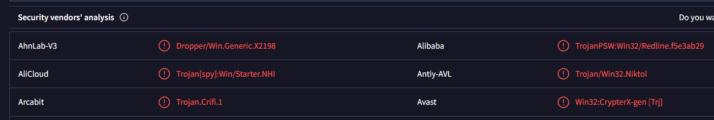

---

### **Q2. Clearly identifying the name of the malware file improves communication among the SOC team. What is the file name associated with this malware?**

**Answer:** WEXTRACT

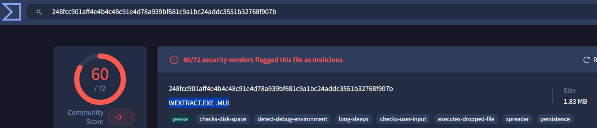
This can be identified along with the hash and file size details.  

---

#### **Q3. Knowing the exact timestamp of when the malware was first observed can help prioritize response actions. Newly detected malware may require urgent containment and eradication compared to older, well-documented threats. What is the UTC timestamp of the malware's first submission to VirusTotal?**

**Answer**2023-10-06 04:41

Located in the [Details](https://www.virustotal.com/gui/file/248fcc901aff4e4b4c48c91e4d78a939bf681c9a1bc24addc3551b32768f907b/details) tab under the **History** section, where it provides when it was created with the timestamp and any other modification on the file.
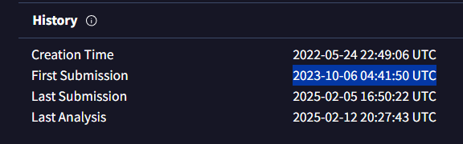

---

### **Q4. Understanding the techniques used by malware helps in strategic security planning. What is the MITRE ATT&CK technique ID for the malware's data collection from the system before exfiltration?**

**Answer:** T1005

On this one got to learn that you should look at what happened before the Command and Control (C2) was executated, which is the collection, which in this phase focuses on gathering data from a target environment.This relates to **Data from Local System**, a technique that focuses on preparing stolen data for exfiltration.  
Located in the **[Behavior](https://www.virustotal.com/gui/file/248fcc901aff4e4b4c48c91e4d78a939bf681c9a1bc24addc3551b32768f907b/behavior)** tab
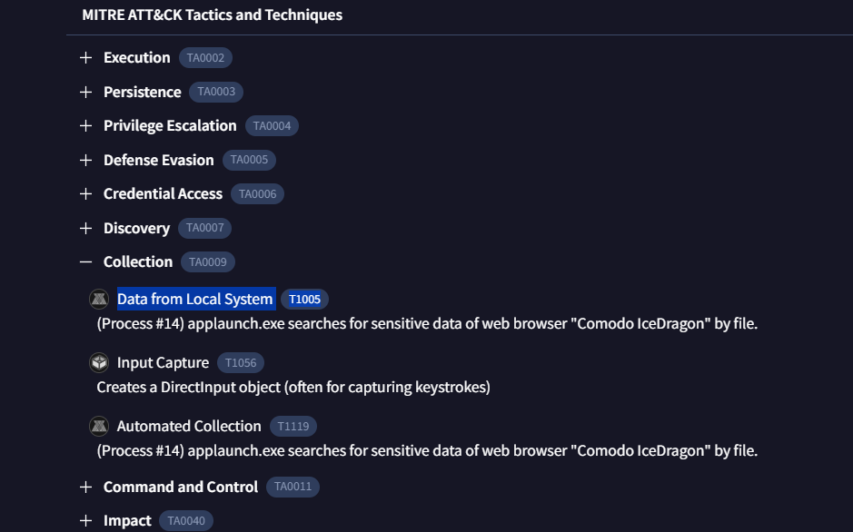

---

### **Q5. Following execution, which social media-related domain names did the malware resolve via DNS queries?**

**Answer:** facebook.com

Lol cause of nerves, I then thought Microsoft, Im screaming!!! Anyways, Identified in the **Relations** tab [Relations](https://www.virustotal.com/gui/file/248fcc901aff4e4b4c48c91e4d78a939bf681c9a1bc24addc3551b32768f907b/relations) tab under **Contacted Domains** and confirmed via [AnyRun](https://any.run/report/248fcc901aff4e4b4c48c91e4d78a939bf681c9a1bc24addc3551b32768f907b/f12132dd-5305-4fc1-bfce-15f2259ca6d9#Network) on the DNS request section you get to see Facebook is there
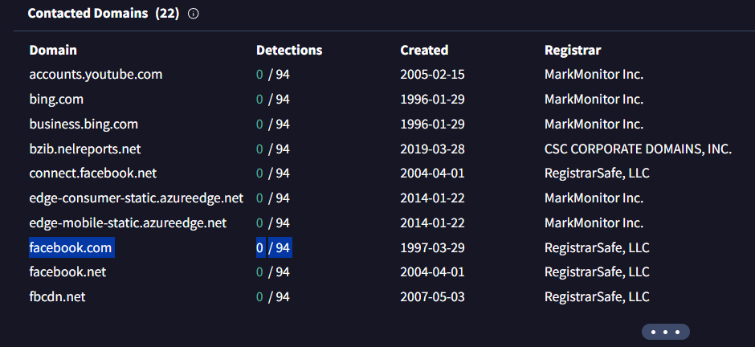

---

### **Q6. Once the malicious IP addresses are identified, network security devices such as firewalls can be configured to block traffic to and from these addresses. Can you provide the IP address and destination port the malware communicates with?**

**Answer:** 77.91.124.55:19071

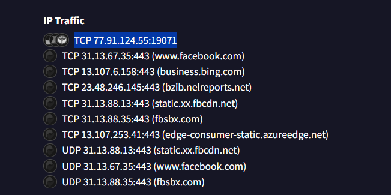

Found in the **Behavior** tab under **IP traffic** [Community](https://www.virustotal.com/gui/file/248fcc901aff4e4b4c48c91e4d78a939bf681c9a1bc24addc3551b32768f907b/community) you get to see that the IP is given on the C2
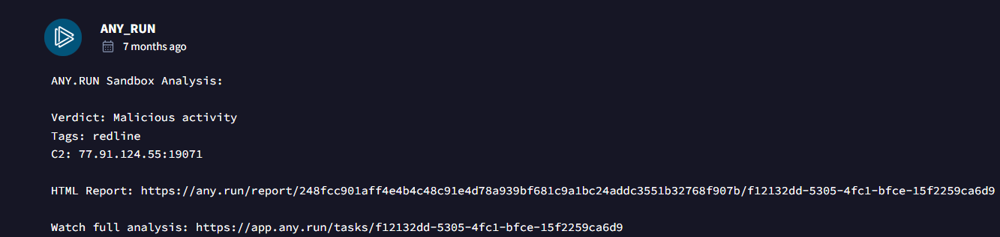

And confirmed in the [AnyRun](https://any.run/report/248fcc901aff4e4b4c48c91e4d78a939bf681c9a1bc24addc3551b32768f907b/f12132dd-5305-4fc1-bfce-15f2259ca6d9#Network) **Network** tab  on the **Malware Configuration**, you see the IP on the C2 on the AppLaunch.exe as we conduct that its a applaunch attack
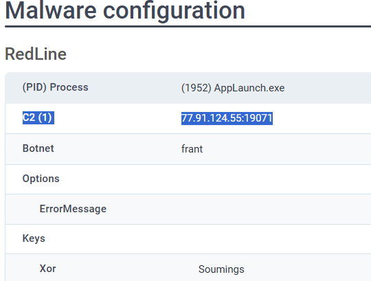

--- 

### **Q7. YARA rules are designed to identify specific malware patterns and behaviors. What's the name of the YARA rule created by "Varp0s" that detects the identified malware?**
**Answer:** [detect_Redline_Stealer](https://bazaar.abuse.ch/sample/248fcc901aff4e4b4c48c91e4d78a939bf681c9a1bc24addc3551b32768f907b#intel)

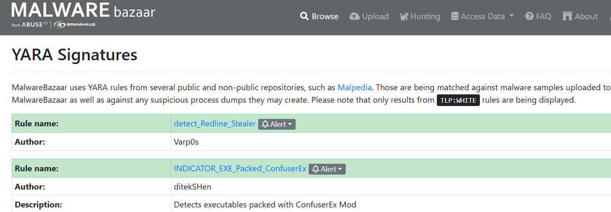

I got to search the Yara on the **Malware bazaar**. On the **AnyRun** on the [Network](https://any.run/report/248fcc901aff4e4b4c48c91e4d78a939bf681c9a1bc24addc3551b32768f907b/f12132dd-5305-4fc1-bfce-15f2259ca6d9#Network) tab and the Behavior activities section you get to see the Yara rule
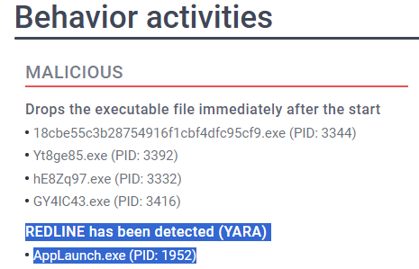

--- 

### **Q8. Understanding which malware families are targeting the organization helps in strategic security planning for the future and prioritizing resources based on the threat. Can you provide the different malware alias associated with the malicious IP address according to ThreatFox?**

**Answer:** RECORDSTEALER.

VirusTotal’s [Association](https://www.virustotal.com/gui/file/248fcc901aff4e4b4c48c91e4d78a939bf681c9a1bc24addc3551b32768f907b/associations)tab, links this malware to **RedLine Stealer**.
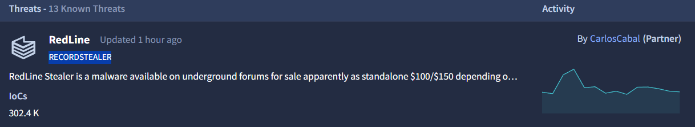

--- 

### **Q9. By identifying the malware's imported DLLs, we can configure security tools to monitor for the loading or unusual usage of these specific DLLs. Can you provide the DLL utilized by the malware for privilege escalation?**
**Answer:** ADVAPI32.dll

Known for **persistence, privilege escalation, code injection, and C2 operations**, this DLL was identified in the **Details** tab under the **Data Link Library (DLL) section**. 
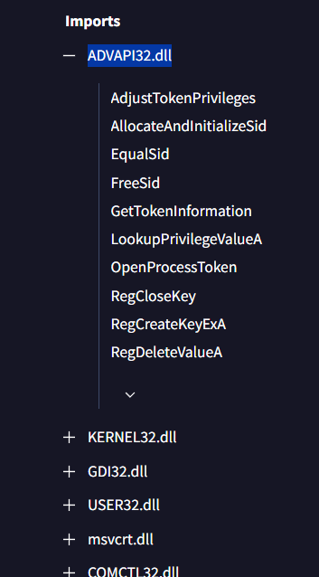
--- 
## **Conclusion:**
This investigation provided valuable insights into **RedLine Stealer**, including its **malware category, tactics, attack vectors, and indicators of compromise (IOCs)**. 

Through the use of **VirusTotal, ANY.RUN, ThreatFox, and MalwareBazaar**, I deepened my understanding of threat intelligence and the critical role it plays in **SOC operations**. 

This hands-on experience highlighted the importance of **comprehensive malware analysis, proactive threat hunting, and cross-referencing multiple intelligence sources** to enhance cybersecurity defenses.

Also, deep knowlege on using **VirusTotal**, I tried everything by  just looking at what information is provided in **VirusTotal**. This was fun , also enformative.

---
